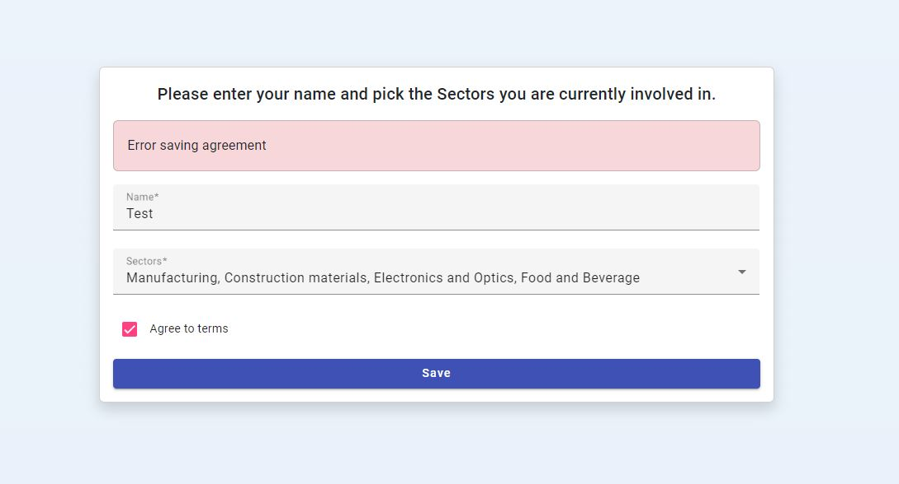
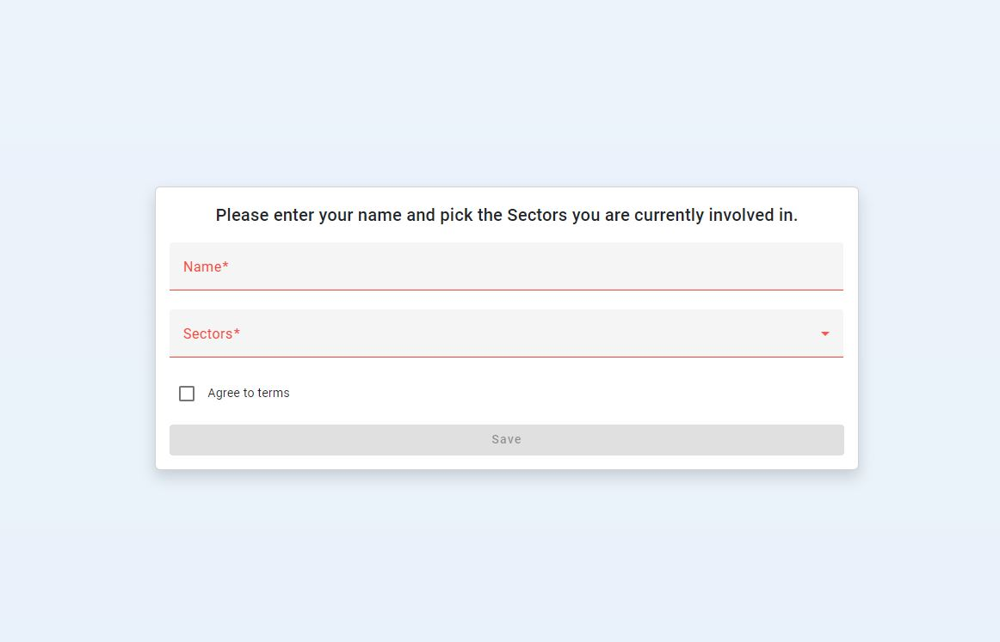

# Backend
Start with command: mvnw spring-boot:run

Database generated with following jdl

``` jdl
entity Agreement {
    name String required
    isAgreed Boolean required
}

entity Sector {
    code String required
    name String required
}

relationship ManyToMany {
    Agreement to Sector
}

relationship OneToMany {
    Sector{children} to Sector{parent}
}
```

Connection details like url, username and password can be changed in backend\src\main\resources\config\application.yml

All test data can be seen in backend\src\main\resources\config\liquibase\data

All validation of fields is done with @Valid on saving and validation annotations on entities

# Frontend

Start with command: npm start (http://localhost:4200/)

## General UI example


## Error handling example



## MultiSelect


## Required fields



